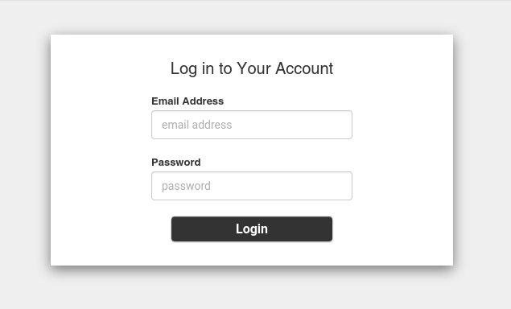
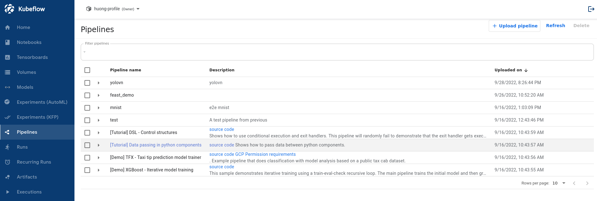
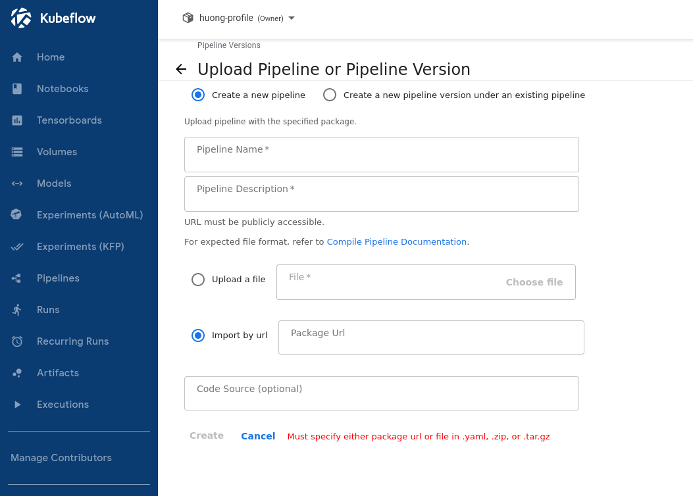
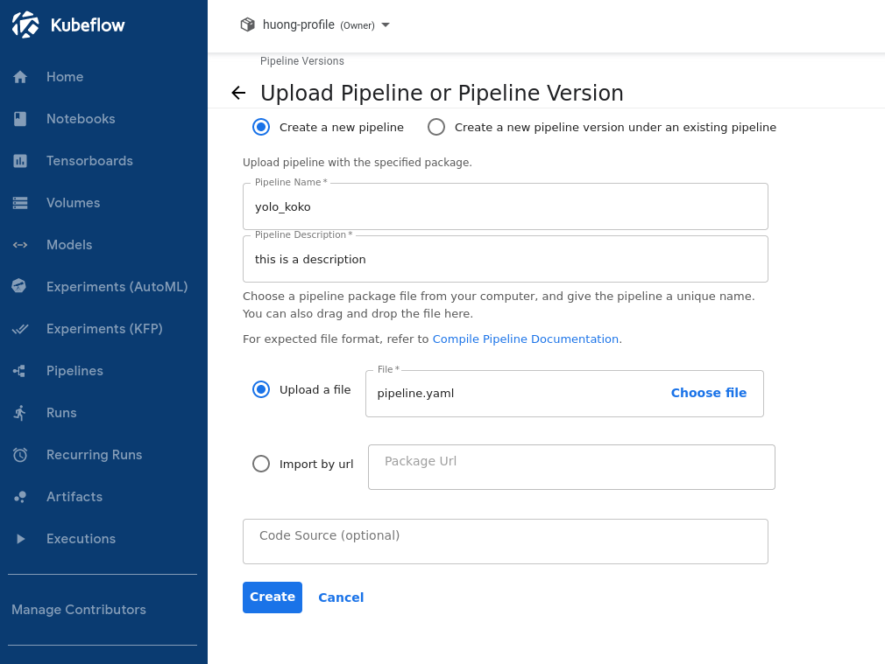
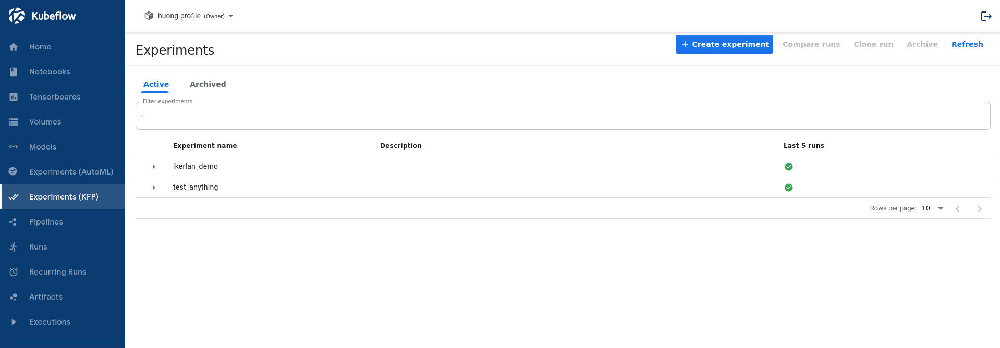
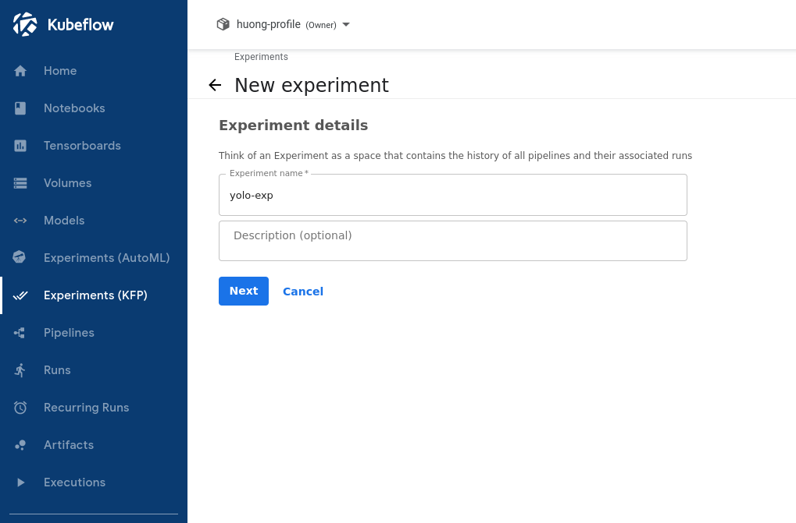
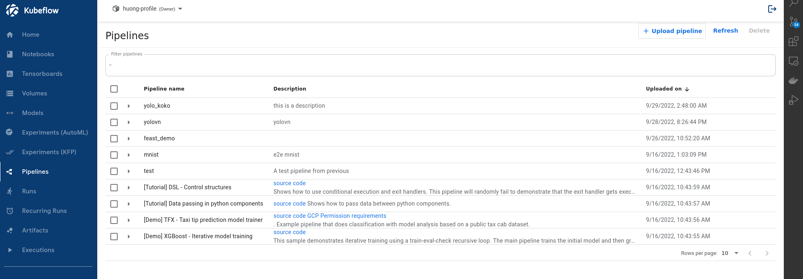
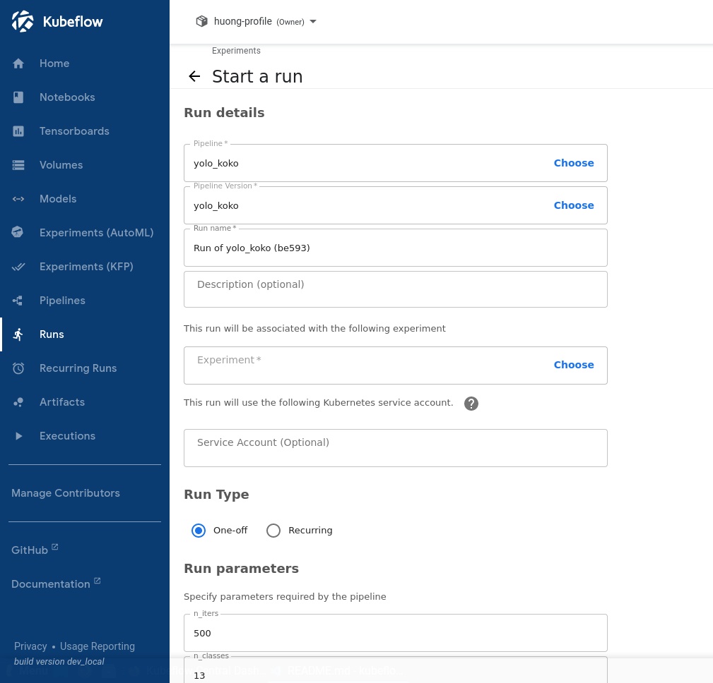

# kubeflow-custom-tinyYOLOV3
Kubeflow training a tiny YoloV3 model with custom dataset. In this example code, it is for PCB data. LakeFS, MLFlow are utilized in this repo. 

## Requirements
- Python 3.8
- kfp library. *Install by:*``` pip install kfp```

## Custom parameters
There are 12 parameters in total that need to be configured before starting a run. Some of them have no default values, some have. However, we still can change it if needed.

1. with_gpu | int
    - *meaning:* train with GPUs or not
    - *values:* 0 or 1
    - *default:* 0 (no GPU)
2. print_training | int
    - *meaning:* print the training output or not (iter, loss, avg loss, etc.,)
    - *values:* 0 or 1
    - *default:* 1 (print)
3. n_iters | int
    - *meaning:* number of training iteration. After this iter, the training process will stop/done
    - *default:* 500 
4. n_clasess | int
    - *meaning:* number of classes in the dataset
    - *default:* 13
5. batch_size | int
    - *meaning:* number of images used in one iteration
    - *default:* 8
6. subdiv | int
    - *meaning:* number of mini-batches. Batch will be subdivided into <u>this many</u> smaller batches. If the GPU/RAM strong and has enough memory, we can set this value small _(eg. 1, 2, 4)_
    - *default:*  4
7. lake_host | str **\<Need to fill this field>**
    - *meaning:* host (address) of the LakeFS
    - *default:* ''
8. lake_user | str **\<Need to fill this field>**
    - *meaning:* registered account's user on LakeFS system
    - *default:* ''
9. lake_pwd | str **\<Need to fill this field>**
    - *meaning:* password of registered account on LakeFS system
    - *default:* ''
10. lake_repo | str **\<Need to fill this field>**
    - *meaning:* the repository that store the data
    - *default:* ''
11. mlflow_server | str **\<Need to fill this field>**
    - *meaning:* the tracking server of MLFlow. Should be something like this: *http://x.x.x.x:8001*
    - *default:* ''
12. threshold | float 
    - *meaning:* model will not return predictions that have confidence scores lower than this threshold
    - *default:* 0.6 (60%)

## Usage
1. Generate the pipeline.yaml
    ```
    python3 pipeline.py
    ```
2. Access kubeflow dashboard and login with registered account (email, password)

    

3. After login, click on ```Pipeline``` on the left panel to show up all the examples or created pipelines

    

4. Click ```+ Upload pipeline``` button near the top right corner

    

5. Fill in the mandatory fields (name, description), upload the pipeline.yaml file then click ```Create```

    

6. After creating the pipeline, on the left panel, click on ```Experiments (KFP)``` to create an experiment. This will used for running the pipeline later on.
    

7. Click ```+ Create experiment``` on the top of the window, fill the *Experiment name* and click next.

    

8. Go back to the Pipelines list by clicking on the ```Pipelines``` tab on the left panel

    

    Click on the pipeline that we've just created and it will jump to the summary view. In here Click the ```+ Create run``` button from top right corner.

    

9. In here, just choose the experiment we've just created and change the parameters at the end of the form *(if needed)* before clicking ```start```.

    

---
**DONE!! NOW JUST WAIT FOR IT TO RUN ....OR TO DUMP AN ERROR :)**

---